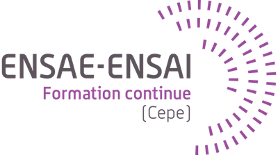

# OC-DAN

Ce dépôt contient mon implémentation de certains projets pour le parcours _[Data Analyst](https://openclassrooms.com/fr/paths/324-data-analyst)_, une formation diplômante (RNCP niveau 6) dispensée par OpenClassrooms en partenariat avec l’ENSAE-ENSAI.

 

> Les projets ont été réalisés entre 2022 et 2023. À noter que la version actuelle du programme de formation peut inclure des projets différents.

## Projet 6

✅ [Analyser les ventes d'une librairie](./projet-6/README.md)\
Analyser la performance d'un site e-commerce pour une librairie et le comportement d'achats de ses clients.

## Projet 9

✅ [Produire une étude de marché](./projet-9/README.md)\
Étudier le marché d'une entreprise grâce à du clustering et une ACP pour faire des recommandations stratégiques.

## Projet 10

✅ [Détecter des faux billets](./projet-10/README.md)\
Construire un modèle de prédiction pour détecter des faux billets grâce à du clustering et de la régression logistique.
